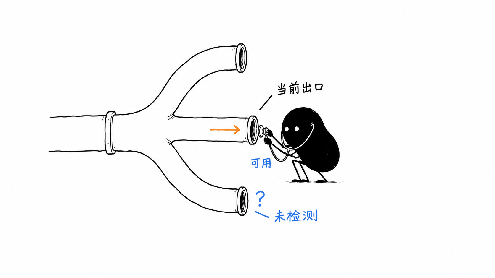

# Mihomo 监控使用指南

本文适用于监控服务 `0.2.4` 和 CPA 菜单入口插件 `0.2.3`。返回[项目首页](../README.md)。



## 用途与适用场景

Mihomo Monitor 把出口、连接与订阅节点信息集中在一个页面，帮助你回答三个日常问题：当前代理组最后选中了哪个出口、某条连接经过了什么规则和节点、订阅中有多少节点拥有可用的检测结果。

如果 CPA 请求经过 Mihomo 出网，可以从 CPA 菜单打开本页面排查出口。如果只需要管理 Mihomo，也可以直接访问独立监控页面。它依赖 Mihomo Controller 提供数据；节点健康与延迟来自 Controller 已有的检测结果，页面本身不发起节点测速。

## 服务与菜单入口怎样配合

| 部分 | 版本 | 放在哪里 | 负责什么 |
| --- | --- | --- | --- |
| 监控服务 `mihomo-monitor-server` | `0.2.4` | 独立进程或容器 | 提供页面、读取 Controller、登录鉴权、执行允许的代理组切换 |
| CPA 入口 `mihomo-monitor-v0.2.3.so` | `0.2.3` | CPA 插件目录 | 注册「Mihomo 监控」菜单，将访问重定向到监控页面 |
| 面板适配 | 由面板维护 | CPA/CPAMP 或其他面板前端 | 如有需要，在同源 iframe 中传递登录信息与主题 |

独立访问的地址为 `/mihomo-monitor/dashboard`。CPA 插件注册的资源路径为 `/v0/resource/plugins/mihomo-monitor/dashboard`，访问该资源会重定向至独立页面。仅安装 `.so` 不会启动监控服务。

本仓库提供前两项。面板的定制补丁和生产部署清单由对应环境维护，更换面板时需要重新验证入口、同源嵌入和登录适配。

## 第一次打开页面

1. 通过已配置的 HTTPS 入口打开 `/mihomo-monitor/dashboard`，或点击 CPA 的「Mihomo 监控」。
2. 输入监控服务的管理密钥。此密钥对应 `MIHOMO_MONITOR_ADMIN_KEY_FILE`，不要与 Mihomo Controller secret 混用。已适配的同源面板可代为建立会话。
3. 先看页面顶部的 Controller 状态和更新时间。确认正在读取新数据后，再查看出口、流量和连接。
4. 在「活动连接」「代理组」「订阅信息」三个标签页之间切换，按需展开连接或节点详情。
5. 如需切换出口，选择候选节点，点击「切换到此节点」，核对组名与目标后再点「确认切换」，等待页面读回结果。

页面在可见状态下，每轮读取完成后约 10 秒发起下一次刷新；可以手动立即刷新或暂停自动刷新。页面隐藏时停止继续安排自动刷新，重新可见时会触发读取。会话有效期为 12 小时，服务重启后也需要重新登录。

## 怎样读懂状态

### Controller 状态与节点状态

顶部的运行状态表示监控数据是否成功取得。代理组卡片上的状态表示该组最终指向的出口是否有健康依据，两者需要分别判断。

| 页面状态 | 含义 | 建议动作 |
| --- | --- | --- |
| 运行正常 | Controller 可达，代理组、Provider 与连接数据读取成功 | 继续查看具体出口和连接 |
| 部分异常 | Controller 可达，但部分数据读取失败 | 根据页面提示检查失败的接口或服务日志 |
| 不可达 | 无法取得 Controller 的版本信息，可能是网络、超时或鉴权问题 | 检查地址、内部网络、secret 与 Mihomo 状态 |
| 读取失败 | 浏览器未能取得监控服务的最新快照 | 查看数据时间；页面可能保留上一次数据 |

| 出口状态 | 含义 |
| --- | --- |
| 可用 | Controller 标记节点可用，或未提供明确健康值且最近一条延迟大于 0；直连出口也显示为可用 |
| 异常 | Controller 标记节点不可用，或出口为拒绝连接 |
| 未检测 | 暂无足够的健康依据，或无法解析到明确出口 |

Controller 明确将普通节点标记为不可用时，旧的成功延迟不会把它改成可用。“未检测”不等于断线，“可用”也不代表刚刚完成了一次新的测速。结合检测时间与实际连接判断；本页面不会自动刷新 Mihomo 的节点测速结果。直连显示可用是出口类型的语义，不是对所有目标网站的连通保证。

代理组可以选中另一个代理组。监控会沿当前选择寻找最终出口，同时展示转发链路；嵌套循环、节点缺失或过深的链路会保留未知。这里的「主出口」是配置指定的展示重点，不代表 Mihomo 的全部流量都经过这一个组。

### 流量与活动连接

下载和上传速度根据前后两次快照中的累计流量差值计算。刚打开页面还没有两个样本，速度可能暂时显示为 0；等待下一轮读取即可。累计值采用 Controller 返回的数据，不是跨重启持久保存的账单或历史报表。

「活动连接」支持按主机、进程或链路搜索，按最近连接、流量或主机名排序。点击连接可查看主机、进程、规则、链路、流向及流量，并复制相关字段。

连接明细最多展示 200 条，每页 8 条；搜索和排序针对已取得的明细。连接总数可能大于明细数量，此时会标注裁剪；不能据此认为其余连接已消失。大响应还有读取与保留上限，若响应无法完整读取，页面会提示连接统计读取失败。

### 代理组与出口切换

页面仅为同时满足以下条件的组提供切换入口：组名列入 `MIHOMO_MONITOR_SELECTABLE_GROUPS`、类型为手动选择 `Selector`、有两个或更多候选。自动选择类的组与未授权的组显示为只读。

服务端在每次切换前重新读取候选列表并校验目标。页面提交后还会读回当前选择；若请求超时，会提示结果尚未确认并尝试读取实际状态。此时先查看当前出口，避免把超时直接当作切换失败。

切换针对后续新建连接，页面不会主动断开已有连接。已有连接仍经过旧出口时，可以查看连接详情中的实际链路；该行为不表示切换一定失败。

### 订阅信息

每个 Provider 显示类型、更新时间、节点总数及可用、异常、未检测数量。展开后查看节点状态和已有延迟信息。每个 Provider 最多列出 500 个节点明细，汇总数量按完整返回列表计算。

此页面用于读取订阅信息。订阅地址、更新策略及节点健康检查仍在 Mihomo 的配置或管理工具中维护。

## 安装与部署

### 准备条件

- 可从监控服务访问的 Mihomo Controller，以及它使用的 secret（若启用了鉴权）。
- 监控服务专用的管理密钥文件。
- 能为 `/mihomo-monitor/` 提供 HTTPS 访问的反向代理。
- 如需 CPA 菜单，使用支持 ABI v1 插件的 CPA，并准备与发布物匹配的 Linux amd64 环境。

浏览器只连接监控服务，由监控服务连接 Controller。将 `18319` 和 Controller 放在内部网络，通过反向代理提供页面访问。

### 安装监控服务

1. 从 [v0.2.4 Release](https://github.com/deepfry666/cpa-mihomo-monitor/releases/tag/v0.2.4) 下载服务产物和 `SHA256SUMS`，核对下载文件。当前预构建服务和入口均为 Linux amd64；其他架构需要自行构建和验证，不能直接使用这两份程序。下载完整发布文件后，可在同一目录执行 `sha256sum -c SHA256SUMS`。
2. 将服务文件置于仓库构建上下文的 `dist/mihomo-monitor-server`，保留可执行权限，执行 `docker build -t mihomo-monitor:0.2.4 .`。源码构建方式见[项目首页](../README.md#从源码构建)。
3. 将容器接入 Controller 所在网络，传入配置并只读挂载密钥文件。镜像使用 UID/GID `65532:65532`，需确保文件对该用户可读。
4. 配置反向代理，保持 `/mihomo-monitor/` 路径前缀。
5. 启动服务后登录页面，确认 Controller 与三类数据读取正常。

下面是容器运行示例。执行前，将 `cpa-internal` 换成现有内部网络，把 `/path/to/` 换成实际文件位置；示例假设 Controller 在该网络中的服务名为 `mihomo`。

```sh
docker run --detach \
  --name mihomo-monitor \
  --network cpa-internal \
  --env MIHOMO_MONITOR_CONTROLLER_URL=http://mihomo:9090 \
  --env MIHOMO_MONITOR_ADMIN_KEY_FILE=/run/secrets/monitor-admin-key \
  --env MIHOMO_MONITOR_SECRET_FILE=/run/secrets/mihomo-secret \
  --mount type=bind,src=/path/to/monitor-admin-key,dst=/run/secrets/monitor-admin-key,readonly \
  --mount type=bind,src=/path/to/mihomo-secret,dst=/run/secrets/mihomo-secret,readonly \
  mihomo-monitor:0.2.4
```

反向代理也需要能访问此内部网络。例如在已配置 HTTPS 的 Nginx `server` 中加入：

```nginx
location /mihomo-monitor/ {
    proxy_pass http://mihomo-monitor:18319;
}
```

这里 `proxy_pass` 未指定新的 URI，因此会保留请求路径。登录 Cookie 带有 `Secure` 属性，普通 HTTP 域名访问可能无法维持登录。通过 iframe 嵌入时使用同源页面；服务的内容安全策略仅允许同源嵌入。

### 安装 CPA 菜单入口

1. 将 `mihomo-monitor-v0.2.3.so` 放入 CPA 的 `plugins/linux/amd64/` 目录。
2. 启用插件 ID `mihomo-monitor`，将该插件配置中的 `store.version` 设置为 `0.2.3`，按 CPA 的版本化加载流程使其生效。
3. 确认面板只出现一个「Mihomo 监控」菜单，访问后能到达独立服务页面。
4. 如需面板自动登录或传递主题，在对应面板中做同源 iframe 适配，并验证传入的密钥能通过监控服务鉴权。没有适配时，可以直接使用独立登录。

仓库的 `scripts/check-registration.py` 可核对 CPA 中的启用状态、注册状态和预期菜单。其 `--base` 指向 CPA 管理地址，`--key-file` 使用 CPA 的管理密钥文件；这项检查不代替监控服务的登录和 Controller 连通检查。

## 配置参考

配置在服务启动时读取。修改环境变量或密钥文件后，需重启监控服务使新值生效。

| 环境变量 | 默认 / 是否必填 | 说明 |
| --- | --- | --- |
| `MIHOMO_MONITOR_ADMIN_KEY_FILE` | 必填，除非使用兼容变量 | 文件内容为监控登录密钥，首尾空白会去除；文件不可读或内容为空时启动失败 |
| `CPAMP_ADMIN_KEY_FILE` | 无 | 旧配置兼容项；仅在上一项未设置时作为管理密钥文件路径使用 |
| `MIHOMO_MONITOR_SECRET_FILE` | 可选 | Controller secret 文件；不设置时请求不带 Controller 鉴权头。已设置却不可读或为空时启动失败 |
| `MIHOMO_MONITOR_CONTROLLER_URL` | `http://mihomo:9090` | 完整 HTTP/HTTPS 地址，不接受内嵌用户名密码、查询参数或片段 |
| `MIHOMO_MONITOR_SELECTABLE_GROUPS` | 空，全部只读 | 逗号分隔的真实组名，去除首尾空白并去重；组名需与 Controller 一致 |

Controller URL 指向 Mihomo 的控制 API 监听地址，不是 HTTP、SOCKS 或 mixed 代理端口。控制接口需要在监控服务所在网络可达；如果它只监听 Mihomo 容器内的 `127.0.0.1`，其他容器无法通过 `http://mihomo:9090` 连接。应按实际网络配置监听地址，并用内部网络及 secret 限制访问。

例如 `MIHOMO_MONITOR_SELECTABLE_GROUPS=主出口,备用出口` 只会授权这两个同名组。将希望突出显示的主组放在第一项，并确保它是存在、可手动选择且有多个候选的 `Selector`；其他条件不满足时，页面不会为它开放切换。修改此配置不会创建 Mihomo 代理组。

服务固定监听 `18319`。管理密钥和 Controller secret 是两种不同用途的凭据，分别放入文件，不写进 README、Compose 的公开版本或 Git 仓库。

## 升级与回退

1. 分别记录当前服务版本和入口插件版本，保留旧镜像或二进制及现有配置。
2. 下载目标版本的产物和校验文件，核对文件与目标平台。
3. 升级服务时替换服务镜像或二进制，保留内部网络、路径和密钥挂载，然后重启。服务重启会清空内存会话，需要重新登录。
4. 只有入口插件版本变化时才升级 `.so`：先放置新版本文件，再按 CPA 流程显式设置对应 `store.version`。不要直接覆盖正在被加载的共享库。
5. 登录确认 Controller 状态、数据更新时间、连接/代理组/订阅三页，再验证菜单与面板适配。
6. 如升级出现问题，恢复之前保留的服务镜像或二进制；入口插件有变化时，也恢复对应版本配置。

`0.2.4` 是服务版本，不能直接填成入口插件的 `store.version`；当前入口版本仍为 `0.2.3`。GitHub Release 更新不会自动升级任何运行环境。运行 `mihomo-monitor-server --healthcheck` 只检查本机页面能否返回成功，不验证登录、Controller 鉴权或出口可用性。

## 常见问题

| 现象 | 检查方向 |
| --- | --- |
| 有 CPA 菜单，点击后 404 或 502 | 确认独立服务已启动、反向代理保留 `/mihomo-monitor/` 前缀、代理能访问容器 `18319` |
| 登录后又回到登录页 | 检查 HTTPS、同源 Cookie、密钥是否正确，以及服务是否刚重启或会话已满 12 小时 |
| 显示 Controller 鉴权失败 | 核对 secret 文件内容与 Mihomo 配置；监控登录密钥不能替代 Controller secret |
| 显示 Controller 无法连接或超时 | 核对 Controller URL、容器网络和 Controller 监听地址；先从监控服务所在网络验证可达性 |
| 顶部运行正常，但出口显示未检测 | 数据读取成功与节点检测结果是两回事；查看 Mihomo 的健康检查配置和已有检测记录 |
| 没有切换按钮 | 核对组名白名单、组类型是否为 `Selector`、候选是否至少有两个 |
| 切换提示未能确认 | 等待或手动刷新，检查读回的当前选择与连接链路；超时不代表 Controller 一定拒绝了操作 |
| 切换后仍看到旧出口连接 | 查看连接建立时间；已有连接不会被页面主动关闭，关注后续新建连接 |
| 活动连接总数与列表条数不同 | 检查「明细有裁剪」提示；列表最多展示 200 条，搜索范围也限于已取得的明细 |
| 看不到订阅信息 | 确认 Mihomo 是否配置了 Proxy Provider，并检查 `/providers/proxies` 的读取提示；静态节点不一定形成 Provider |
| 有些统计暂时不可用 | 根据页面的具体失败提示检查服务日志；一次连接统计失败不意味着代理组和 Provider 数据也失败 |

排查时优先记录页面状态、数据更新时间、服务与入口版本以及不含密钥的错误信息。点击页面上的“退出”且请求成功后，当前会话才会注销；仅离开页面或关闭标签页不会提前结束服务端的 12 小时会话。若页面提示“未能确认退出”，需要重新尝试。
